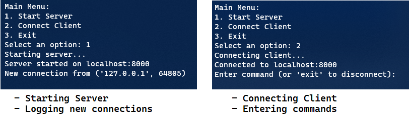

# Haus Engineering: In-Memory Key/Value Data Server
Author: [Jose Morales](https://www.linkedin.com/in/moralesdev/)

## Introduction ⚡

This project implements an in-memory key/value data store server that supports transactions. The server can accept multiple clients and handle commands to add, retrieve, update, and delete key/value pairs, as well as manage transactions.

### Table of Contents
1. [Installation 🎉](#installation-)
2. [Usage 💎](#usage-)
3. [File Structure 👨‍💻](#file-structure-)
4. [Classes Overview 🎨](#classes-overview-)
5. [Assumptions 📚](#assumptions-)
6. [License](#license)

## Installation 🎉

1. Clone the repository or download the source code: 
```bash
git clone https://github.com/devoftheweb/haus-eng.git
```
2. Ensure you have Python 3.x installed: `python --version`
3. Navigate to the project directory in your terminal: `cd path/to/repo`
4. Run the server and client as described in the Usage section below.

## Usage 💎

### 1) `Client` class

1. Run the Server. The server will start, and you can connect clients to it.

```bash
python server/server.py
```

2. Run a Client

You can use the `Client` class in the `client/client.py` file to connect to the server, send commands, and receive responses.

```python
from client.client import Client

client = Client()
client.connect()

# Sending a BEGIN command to start a transaction
response = client.send_command("BEGIN")
transaction_id = response['transaction_id']
print(f"Transaction started with ID: {transaction_id}")

# PUT command to add a key-value pair
response = client.send_command(f"PUT key1 value1 {transaction_id}")
print(response['status'])  # Output: {'status': 'Ok'}

# Disconnect from the server
client.disconnect()
```

### 2) CLI

1. Navigate to project directory root
2. Run `python main.py`
3. Choose from one of these options:
```bash
Main Menu:
1. Start Server
2. Connect Client
3. Exit
Select an option:
```
4. Example use for Connect Client: `PUT key1 value1`




## File structure 👨‍💻

```bash
client/: 
    client.py: Class for client connections.
    
server/:
    server.py: Main server class handling client connections and dispatching commands.
    command_parser.py: Parse and validate client commands.
    shard.py: Shard in sharding mechanism.
    sharding_manager.py: Manages shards.
    data_store.py: In-memory key-value store, managing transactions.
    transaction.py: Handling individual transactions.

tests/:
    test_server.py: Unit tests for the server class.
    test_command_parser.py: Unit tests for the command parser class.
    test_data_store.py: Unit tests for the data store and transaction classes.

main.py: CLI
```

## Classes Overview 🎨

- `Server`: Accepts client connections, reads commands, and dispatches them to the appropriate handlers.
- `CommandParser`: Parses and validates client commands, translating them into actionable requests.
- `DataStore`: Manages the in-memory key-value store, supports basic CRUD operations, and controls transactions.
- `Shard`: Represents a shard within the sharding mechanism.
- `ShardingManager`: Manages the shards in the system, distributing keys among shards, and retrieving the appropriate shard for a given key.
- `Transaction`: Manages an individual transaction, including tracking changes and allowing commits and rollbacks.
- `Client`: Used by clients to connect to the server, send commands, and receive responses.

## Assumptions 📚

In a production environment, we would have authentication, authorization, persistence, concurrency control, locking, multi-client, and other important features.

The assumptions made are:

- **Single Machine Deployment**:
  - Implementation does not include authentication, encryption, or other security measures that would be necessary for a public-facing server.
- **In-Memory Storage**:
  - Data does not persist between server restarts. Speed is prioritized over persistence. In-memory storage allows for faster access times.
- ~~**No Concurrency Control for Multiple Clients**~~:
- **Simplified Command Syntax**:
  - Helps in parsing and handling commands efficiently.
- ~~Single Client Session Transactional Consistency~~:
  - Transactions are handled within the context of a single client session. 
- **UTF-8 Encoding**:
  - Standardizes the encoding across the system, ensuring consistent interpretation of strings by both the server and clients.

## License

This project is open source and available under the MIT License. 